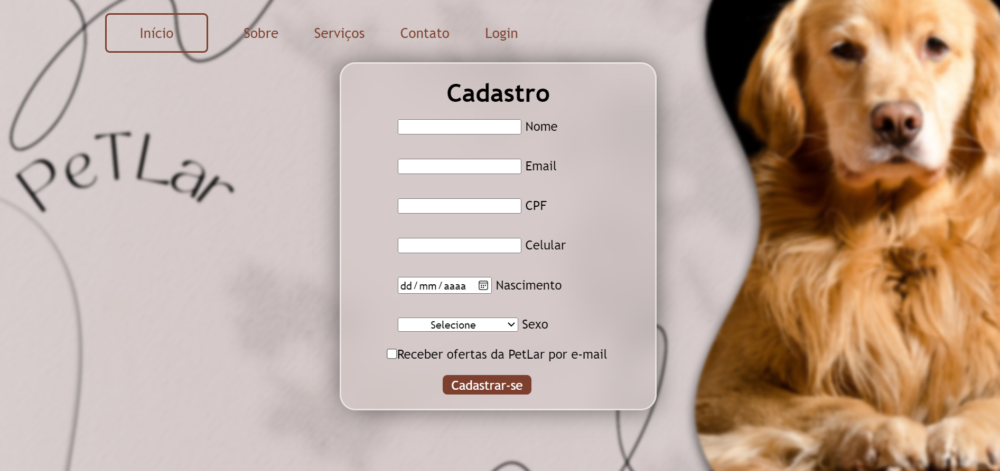
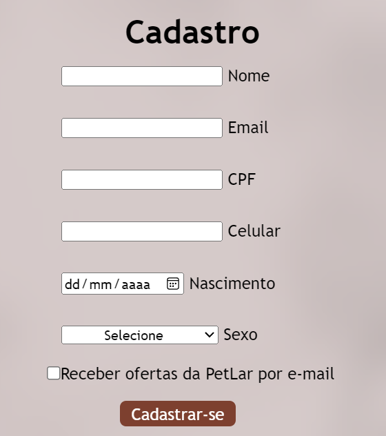

# PetLar 🐩🐾🐈
Formulário de cadastro para o acesso ao site da petshop PetLar.

## 💻 Menu do site
O menu deste site conta com os botões interativos:   
-início;  
-sobre;  
-serviços;  
-contato;  
-login.  

## 📜 Formulário
O formulário possui campos para o preenchimento do cadastro.  
Devem ser completados:  
-Nome; 
-Email; 
-CPF; 
-Celular; 
-Data de nascimento; 
-Sexo; 
-Opção de ofertas.    

## 👩‍💻 Tecnologias utilizadas
